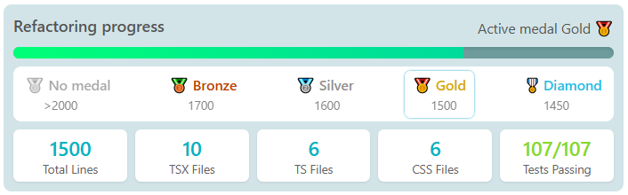

#  React Refactoring Workshop (90 min)

A gamified workshop to refactor React code, and improve quality by reducing duplication and removal of unused code.

- `react-refactor-workshop/notes-app` work in this folder.
- `react-refactor-workshop/notes-app-solution` A proposed solution located here.

## 🛠️ Setup

```bash
# Clone the project: open a terminal in a folder anywhere on your machine and clone the project:
git clone https://github.com/Equinor-Playground/react-refactor-workshop.git
or ssh:
git clone git@github.com:Equinor-Playground/react-refactor-workshop.git

# In the terminal navigate into the folder: notes-app
cd react-refactor-workshop/notes-app
npm install
npm start

# When doing tasks a bit later, keep a separate terminal ready for these commands
npm run knip
npm test
```

# 🥉🥈🥇 Gamification

A popover tracks your progress towards the proposed solution's code size (1500 lines 🥇Gold ).
If you reach Diamond 🎖️, you will have done better than the solution project. The metrics server is quite resource intensive, consider "pausing" it if your laptop starts to struggle.

- 🥉 **Bronze**: 1700 lines
- 🥈 **Silver**: 1600 lines
- 🥇 **Gold**: 1500 lines
- 🎖️ **Diamond**: 1450 lines

<div style="margin-top: 20px"></div>



# 🚀 Workshop Tasks

### 🧹🎨 Note!

This project (notes-app folder) is intentionally a mess. Over 21.05% of the code is nonsense! The tasks are meant to give a general order of cleanup, but we encourage you to just generally keep an eye out for messy code. Be ruthless in your cleanup, and remember that all written code should be doing work!

No CSS changes are required to achieve the Gold medal. Focus on code cleanup first! You are still allowed to remove CSS as long as the app looks and feels the same as the solution app (located in notes-app-solution).

- You can run `npm test` to see more details if you get failed tests in the metrics popover.
- If you don't use `Knip` you can still also right click on a function/variable/component and click Find references, and VSCode will show if its in use.

### 📋 Task 1: Remove Unused Code (10 min)

1. In a separate terminal run `npm run knip` to identify and delete all listed unused code
2. Verify that tests still pass by running `npm test`

### 📋 Task 2: Clean up unneeded JSX (25 min)

Often, there will be a bunch of `<div></div>` or fragments `<></>` in the code that are not needed.
They can even have classes too! It can be challenging to spot these cases but finding and removing them is important.

1. Find and delete empty divs with no styles or classes.
2. Find and delete fragments.
3. Find and delete divs with inline styles "style={{....}}" that are not displayed
4. Bonus: Find and delete unused props on components.

### 📋 Task 3: Delete unused but seemingly complex code (25 min)

Often in production code, there can be `useEffects`that seem to be doing a lot of important work. However often we stumble in code that is not needed. Unused useEffects has potential to introduce a lot of bugs and performance problems due to rerenders if not handled well.

- Knip is unable to detect useEffects that are not doing anything productive, and tests still pass regardless. You will have to carefully find and delete them on your own.

1. Find and remove useEffects in the code that are not needed.

### 📋 Task 4: Avoid duplication (30 min)

1. `Note.tsx` and `CreateNote.tsx` have essentially the same Footer code.
2. See if you can find the existing footer component, it can replace the duplicated code `Note.tsx` and `CreateNote.tsx`.
3. Remember to remove any code not in use `Note.tsx` and `CreateNote.tsx` after the refactor.
